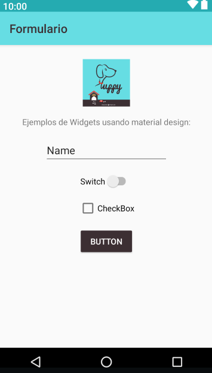

# Formulario
Tarea 1 - Desarrollando aplicaciones con Android - Coursera

Elaborado por IDBV

Este proyecto consiste unicamente en ejemplos de Views aplicando los colores Material Design seleccionados, 
basandose en la [imagen de muestra](./app/src/main/res/drawable/revisionporpares1_curso3.png).

##Screenshots

