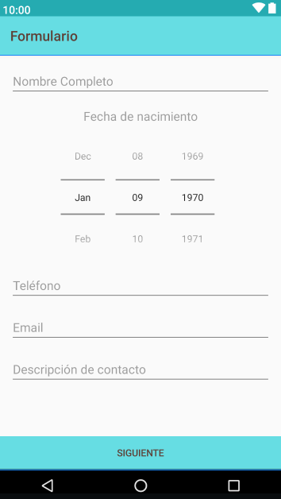
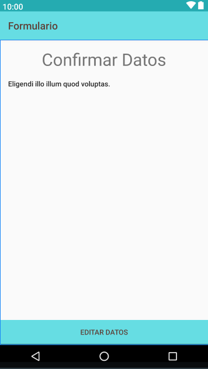

# Formulario
Tarea 1 - Desarrollando aplicaciones con Android - Coursera

Elaborado por IDBV

Este proyecto consiste en un formulario de contacto utilizando Views con estilos de Material Design seleccionados, 
basandose en la [imagen de muestra](./app/src/main/res/drawable/revisionporpares1_curso3.png).

La aplicacion contiene 2 actividades que lanzan Intents al presionar el boton 

## Screenshots

